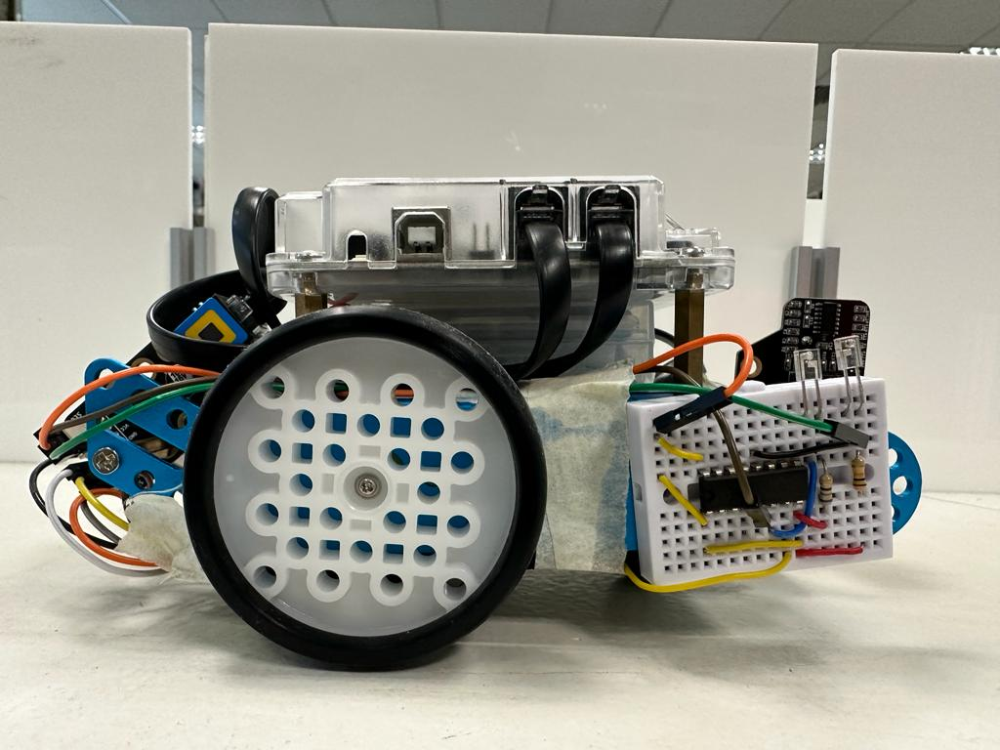
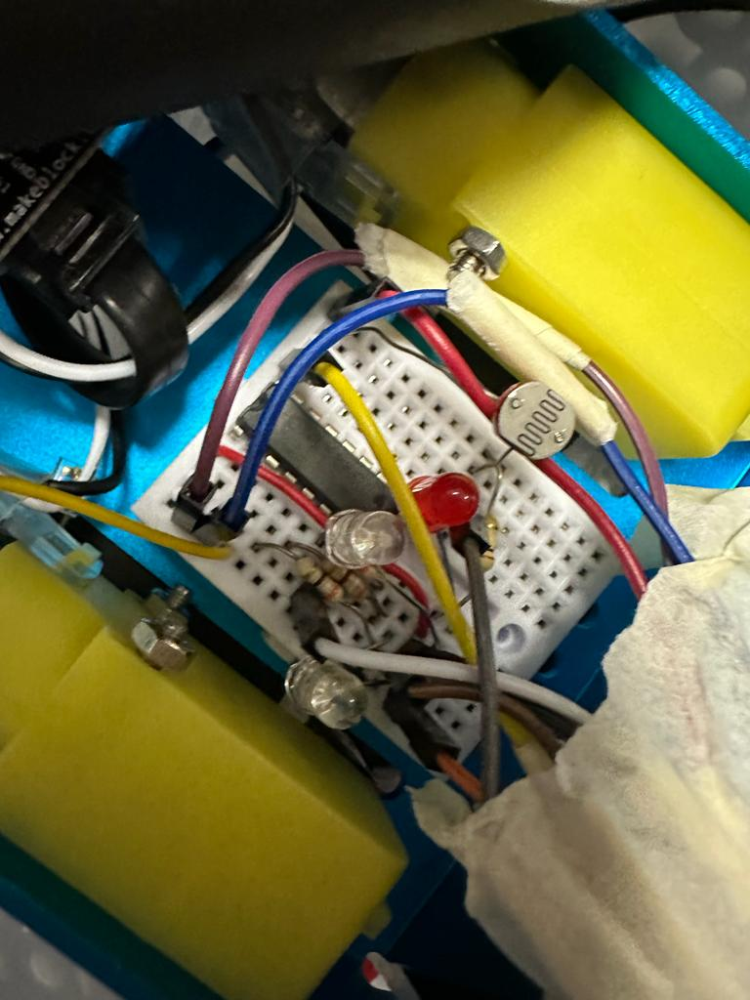
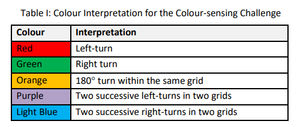
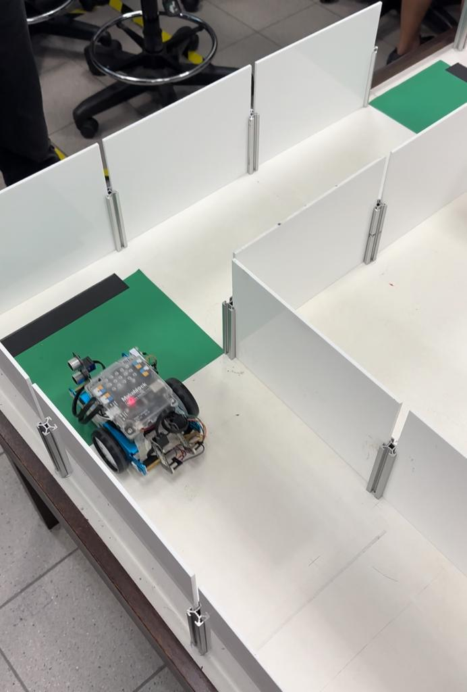

# CG1111A The A-maze-ing Race Project 2022

The objective of this project was for students to build sensors and program a robot to traverse a simple maze in the shortest time.

### Task Definition

The mBot starts moving forward from the starting position. Once the mBot encounters a black line, it stops, and detects the colour of the sheet of paper underneath it, and turns in the direction according to the colour of the paper. When the mBot stops at the last black line with a white sheet of paper, it should play a celebratory tune.

View our thought process and calculations made in /Final Report - B03-S2-T2.pdf
